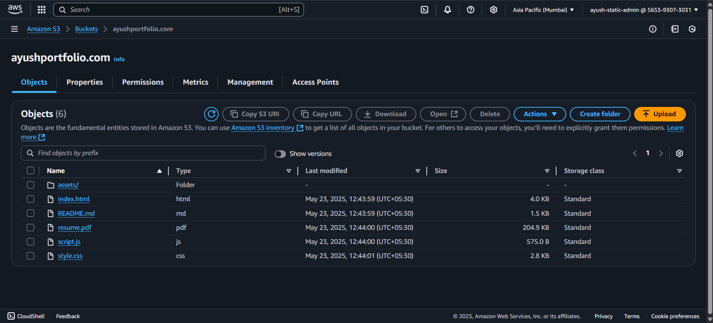
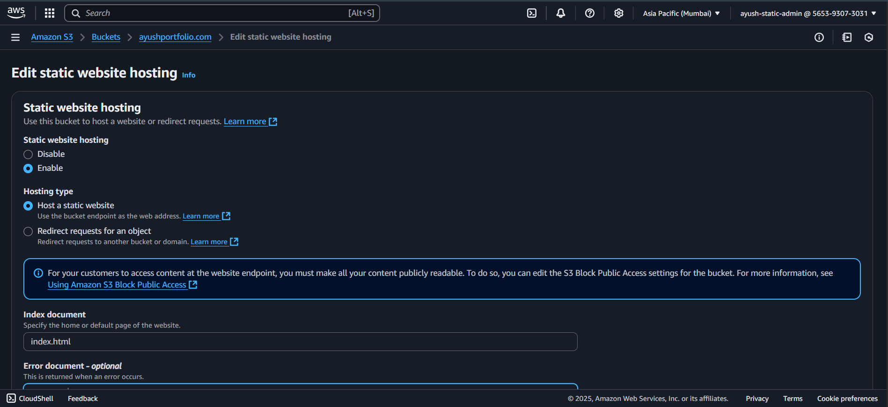
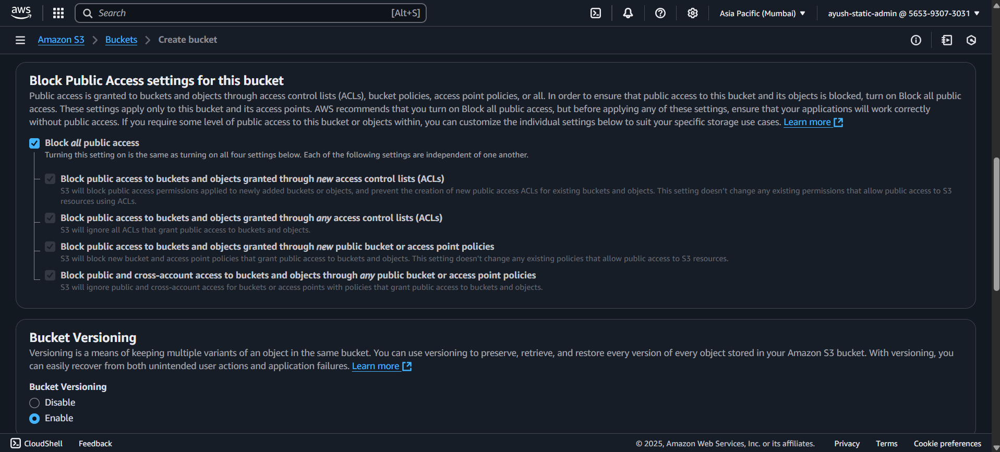
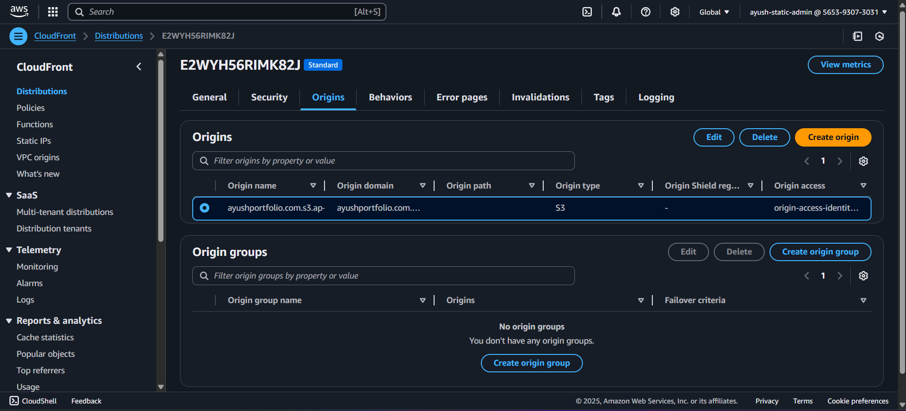
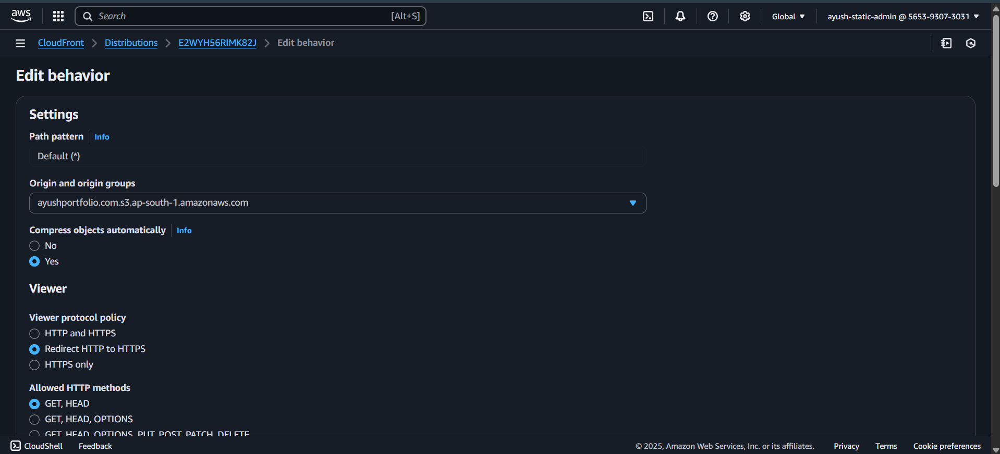
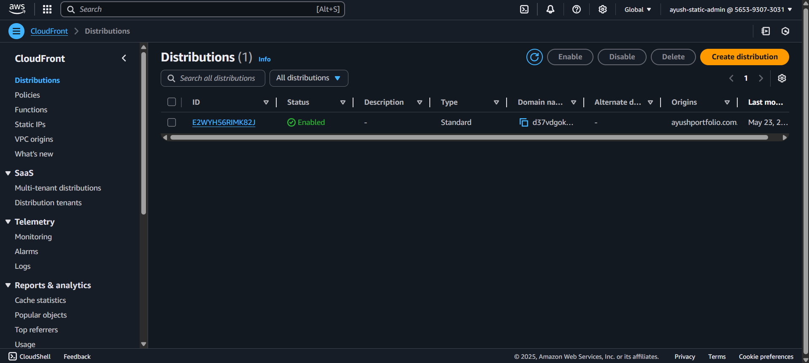
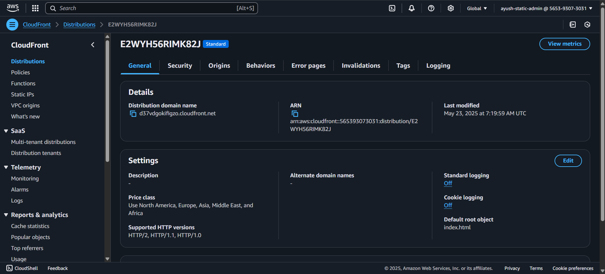
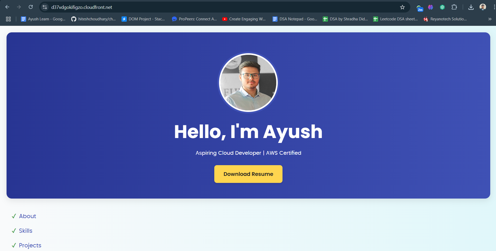
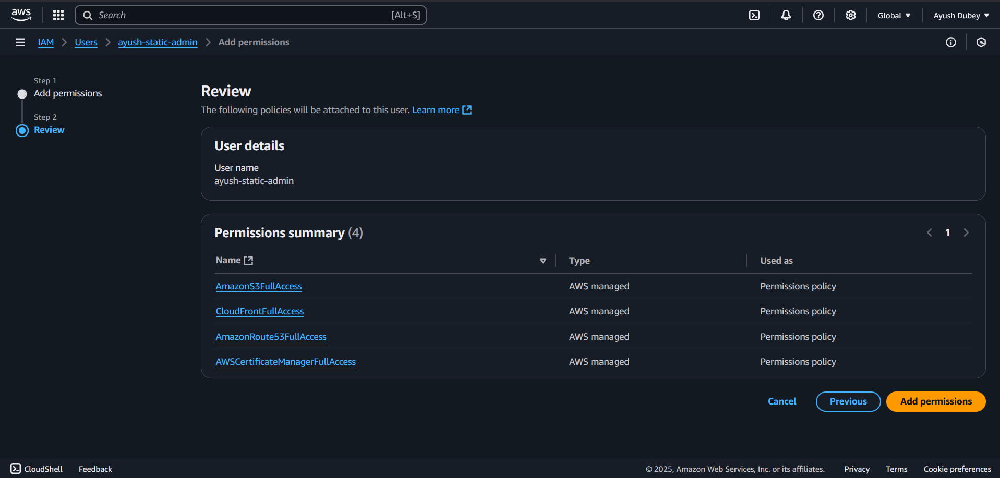

# 🌐 AWS Static Website Hosting – Portfolio Deployment

This repository documents how I hosted my portfolio website on AWS using:

- **IAM** (secure access control)
- **Amazon S3** (static hosting)
- **CloudFront SSL** (default HTTPS certificate)
- *(Optional)* **Route 53 & ACM** (for custom domain - skipped)

---

## 🚀 Live Website

🔗 [Visit Live Portfolio](https://d37vdgokifigzo.cloudfront.net)  
🔗 [Portfolio Source Code Repository](https://github.com/ayushdubey025/Portfolio)

---

## 📂 Repository Purpose

This repo contains:
- Configuration steps
- AWS console screenshots
- IAM security overview
- Project architecture
- What I learned from building and deploying the solution

---

## 🛠️ AWS Services Used

| Service        | Purpose                                  |
|----------------|------------------------------------------|
| Amazon S3      | Host static portfolio files              |
| CloudFront     | Global content delivery and HTTPS        |
| IAM            | Secure access to AWS services            |
| Route 53       | Domain and DNS management (optional)     |

---

## 🔐 IAM Setup

- Created a dedicated **IAM user** with `AmazonS3FullAccess`
- Used **IAM roles** to avoid using root account
- Attached only the necessary permissions for this project
- All operations done via AWS Console (no CLI used)

---

## 📸 Screenshots

| Step                        | Screenshot                                     |
|-----------------------------|------------------------------------------------|
| S3 Files & Folders          |            |
| S3 Static Hosting Settings  |          |
| S3 Public Access Policy     |       |
| CloudFront Origin Settings  | |
| Default Root Object (index) |  |
| CloudFront Deployment       |  |
| CloudFront Deployment       |  |
| Final Website Output        |    |
| IAM Policy Configuration    |          |

---

## 🧠 What I Learned

- How to host and manage static websites securely using Amazon S3
- Using Amazon CloudFront for global content delivery and HTTPS with default SSL
- Managing IAM users and policies for least-privilege access and avoiding root credentials
- Hands-on experience with AWS services like S3, CloudFront, and IAM to deploy real-world infrastructure
- Understanding AWS security best practices and free-tier cost optimization

---

## 📌 Note

👉 The actual portfolio website code is in a separate repository:  
🔗 [Portfolio Source Code](https://github.com/ayushdubey025/Portfolio)

---

## 📫 Contact

- Email: [ayushdubey0806@gmail.com](mailto:ayushdubey0806@gmail.com)  
- LinkedIn: [linkedin.com/in/ayush-dubey66](https://www.linkedin.com/in/ayush-dubey66/)  
- GitHub: [github.com/ayushdubey025](https://github.com/ayushdubey025)

---

